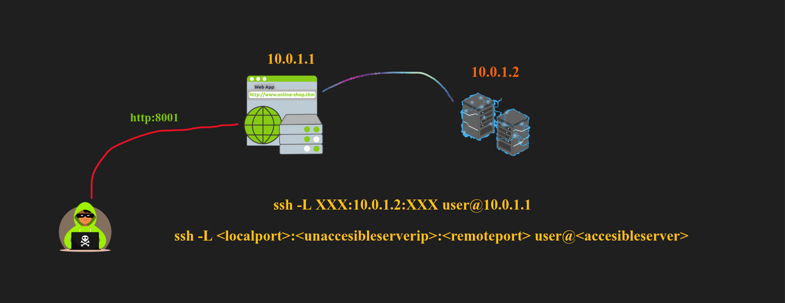

# ssh

```
chmod 600
ssh -i <archivo_llave> <usuario>@<ip>
```

#### Enviar llave ssh a remoto

```shell
# Local
ssh-keygen -f <usuario>
cat <usuario>.pub | base64 -w 0
#Remoto
echo <base64>.pub | base64 -d > /home/<usuario>/.ssh/authorized_keys
```

## Tunneling



```bash
ssh -L <puertolocal>:<direccion victima>:<puerto victima> <usuario>@<IP>
```

```bash
ssh -D <puerto dinamico> -L6801:127.0.0.1:5001 -L<puertolocal>:127.0.0.1:<puerto victima> <usuario>@<IP>
```

#### Verificacin


[red.md](red.md)




